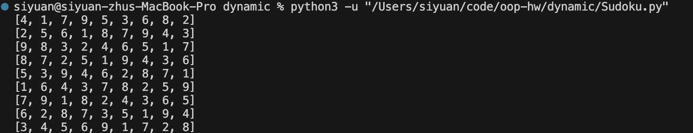
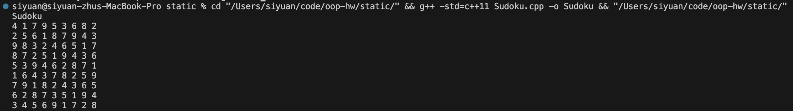

# 数独

## 规则

- 数独网格由9x9个空格组成
- 您只能使用数字1到9
- 每个3×3宫只能包含数字1到9
- 每一列只能包含数字1到9
- 每一行只能包含数字1到9
- 每个3×3宫、每一列或每一行中的每个数字只能使用一次
- 当所有数独网格都填入正确的数字时，游戏结束

## 题目要求

Input：017903600000080000900000507072010430000402070064370250701000065000030000005601720

解析字符串输入，得到Sudoku实例

推理棋盘，得到各单元格候选值

场景下其它合理功能

## Python版

输出结果

## C++版

输出结果

